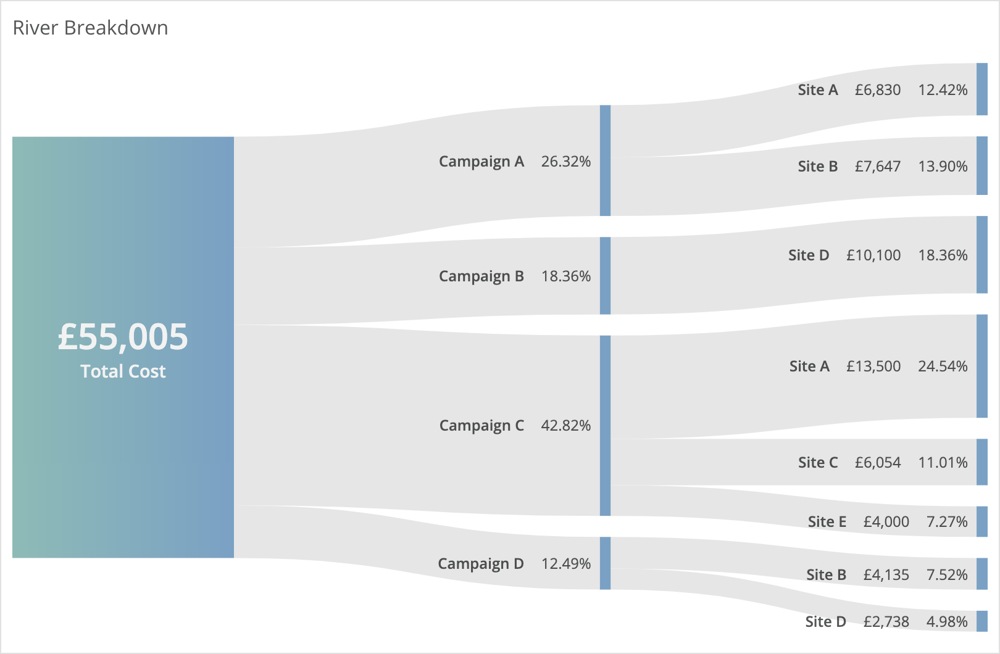

# river-breakdown
Custom widget for Datorama. Visualises hierarchical breakdowns.

This custom widget creates river-like breakdowns for each dimension you add, and gives you context-specific mouseover percentage calculation. It doesn't re-combine like a sankey flow diagram, as the intention is to show hierarchies.

Subtotals of actual values currently aren't possible, since that data is not included in the widget query response.



## Common Style Changes
To change the color of the blocks and paths, add the below to the CSS section of the Custom Widget Editor. To look ideal, `rect-end` in the gradient should have the same colour as `rect`.
```
#level0-gradient {
  --rect-start: rgb(134, 188, 182);
  --rect-end: rgb(117, 161, 199);
}

rect {
  fill: rgb(117, 161, 199);
}
```

## Set up and Dependencies
Add `riverBreakdown.initialize()` to the JS section, and add the below dependencies to the second tab of the Custom Widget Editor.

Script dependencies (must be loaded in this order):
1. https://d3js.org/d3.v5.min.js
2. https://dato-custom-widgets-js-css.s3.eu-west-2.amazonaws.com/river-breakdown/River+Breakdown.js

Style dependency:
1. https://dato-custom-widgets-js-css.s3.eu-west-2.amazonaws.com/river-breakdown/River+Breakdown.css
